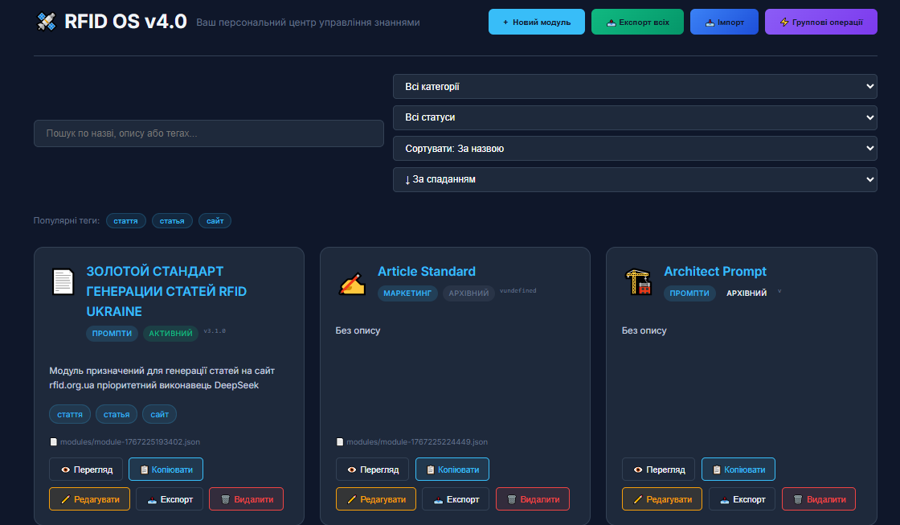

# 🛰️ RFID OS v4.0 — Master Hub

Персональний офлайн-центр управління знаннями.  
Повністю безкоштовно, без серверів, на JSON-файлах.

## 🚀 Особливості

- Повністю офлайн (localStorage)
- Markdown з живим прев’ю та підсвіткою коду
- Версіонування модулів з історією
- Групові операції (bulk)
- Імпорт/експорт одного модуля чи всієї бази
- Пошук, фільтри, сортування (включно по версії)
- Автодоповнення тегів + популярні теги
- Темна тема, адаптивний дизайн
- Клавіатурні скорочення

## Порівняння з аналогами

| Фіча              | RFID OS       | Notion       | Obsidian     | Confluence   |
|-------------------|---------------|--------------|--------------|--------------|
| Офлайн            | ✅ Повний      | ❌ Ні         | ✅ Так        | ❌ Ні         |
| Ціна              | ✅ Безкоштовно | 💰 $10/міс    | 💰 ~$8/міс    | 💰 $5+/міс    |
| Формат даних      | ✅ JSON       | ❌ База даних | ✅ Markdown   | ❌ База даних |
| Версіонування     | ✅ Вбудоване   | ⚠️ Платно    | ✅ Git        | ⚠️ Платно    |
| Кастомізація      | ✅ Повна       | ❌ Обмежена   | ⚠️ Плагіни   | ❌ Обмежена   |

## ⚙️ Як запустити

1. Клонуй або скачай ZIP
2. Відкрий `index.html` у браузері

Готово. Жодних установок.

## 📂 Структура
├── index.html
├── styles.css
├── modules/          ← твої JSON-модулі
└── scripts/
## 🤝 Контриб’ютити

Велкам нові модулі, фічі, переклади!

## 📜 Ліцензія

MIT License

---

Built in a few hours on January 1, 2026 with the help of AI assistants 🚀
## ☕ Support the project / Підтримати проєкт

Якщо RFID OS допомагає тобі — купи мені каву! ☕❤️  
Це мотивує розвивати проєкт далі.

If RFID OS helps you — buy me a coffee! ☕❤️  
It keeps me motivated to improve the project.

Дякую за підтримку! / Thanks for the support!
